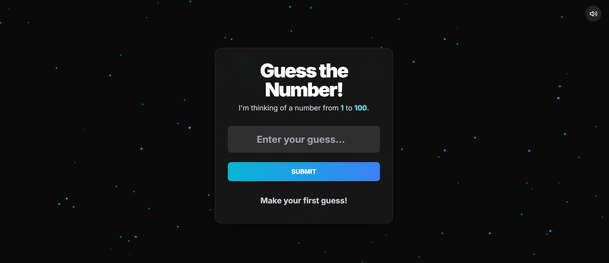
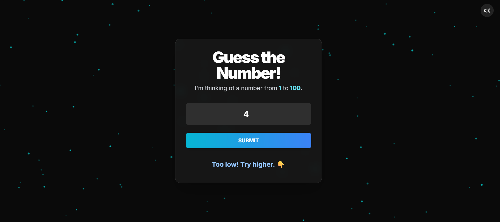
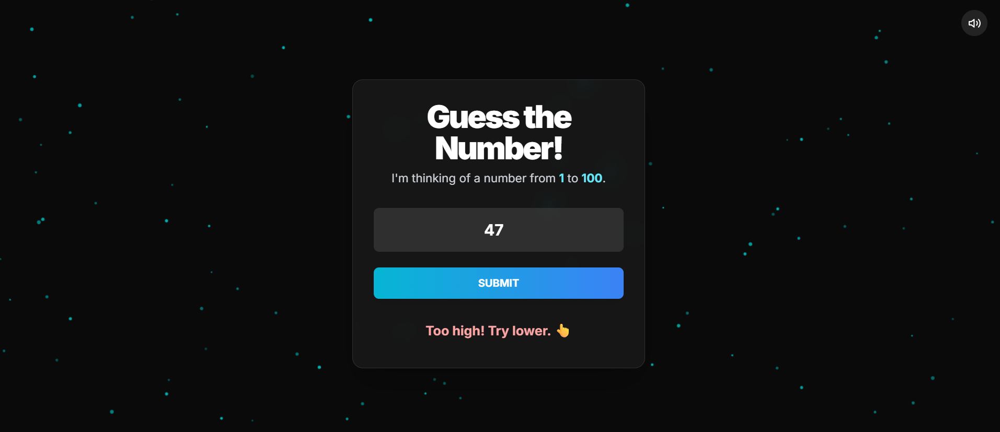
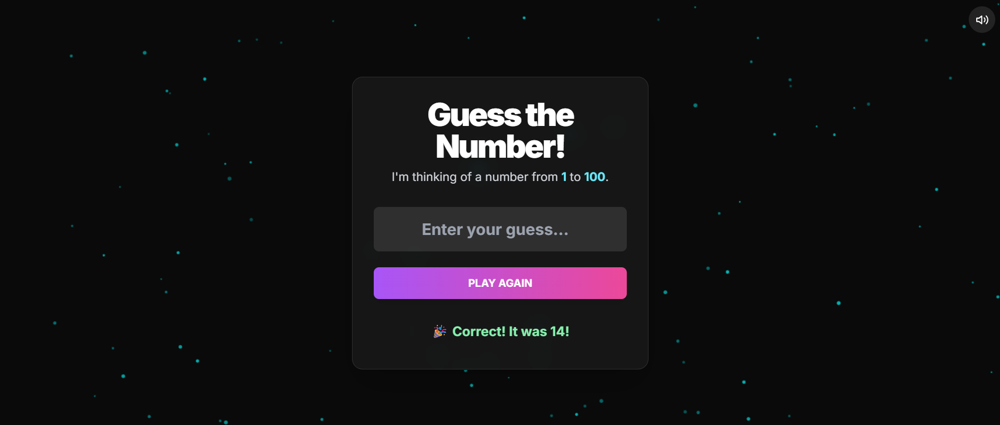

# SCT_SD_2


# 🎮 Number Guessing Game - GUI Edition

A fun and fully interactive number guessing game with a **modern glassmorphism UI**, **animated background**, **sound effects**, and **confetti celebration** – all built using **HTML**, **Tailwind CSS**, and **JavaScript**.

🔗 **Live Demo**: [Click to Play](https://devikaraji.github.io/SCT_SD_2/)


---

## 🧠 Game Objective

Try to guess the secret number between **1 and 100**!  
Get instant feedback on your guess — too low, too high, or correct — with sound, animations, and fun visuals.

---

## ✨ Features

- 🎯 Number guessing game logic
- 🔊 Sound effects via Tone.js
- 🎉 Confetti animation when the user wins
- 🌌 Particle animated background (canvas-based)
- 🧊 Stylish glassmorphism card UI
- 📱 Fully responsive design (mobile + desktop)
- 🔇 Sound toggle (mute/unmute)

---

## 🚀 Live Preview






---

## 🛠 Tech Stack

| Layer     | Tech Used                       |
|-----------|----------------------------------|
| Frontend  | HTML, Tailwind CSS, JavaScript  |
| Effects   | Tone.js (Sound), Canvas Confetti |
| Fonts     | Google Fonts - Inter             |
| Styling   | Tailwind CSS + Custom CSS        |

---
🙋‍♀️ Author
Devikaraji

🌐 GitHub  https://github.com/Devikaraji

💼 LinkedIn  https://www.linkedin.com/in/devika-krishnan-7381721b2/
## 🧾 How to Run Locally

1. **Clone this repository**:
   ```bash
   git clone https://github.com/your-username/your-repo-name.git
   cd your-repo-name
📝 Additional Notes
Developed as part of the Software Development Lab project.

Enhancements include responsive UX, game accessibility, and animated visuals.
